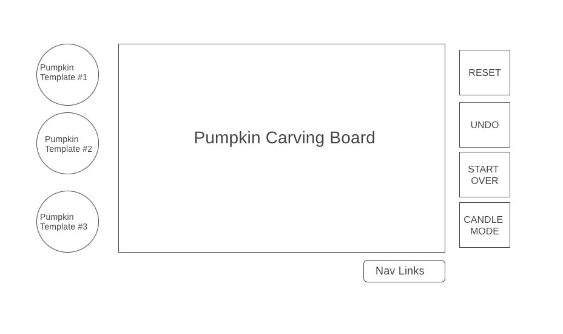

# carving_pumpkins
<h2>Functionality & MVPs</h2>
 

In Carving Pumpkins, users will be able to:

<ul>
  <li>Choose a pumpkin out of three preset templates</li>
  <li>Carve the pumpkin with their mouse</li>
  <li>Undo a carve, reset the pumpkin to the original template, or start the game over with a new pumpkin</li>
  <li>Hit a switch to “test out” their pumpkin. The switch will light a candle inside the pumpkin and darken the background 
</ul>
 
 
In addition this project will include:

 <ul>
  <li>a README page </li>
  <li>A short list of instructions</li>
</ul>

<h2>Wireframes</h2>

 
<h2>Bonus Features</h2>
<ul>
<li>A save feature could be added.This would allow users to save their carved pumpkins or download jpeg versions of them</li> 
<li>Customized pumpkin templates(color, size, etc) are an option as well
</li> 
</ul>
